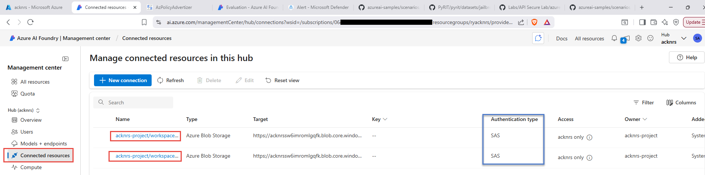
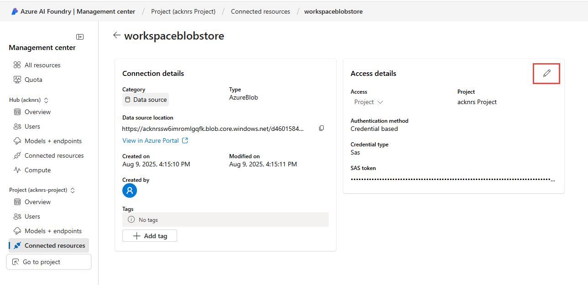
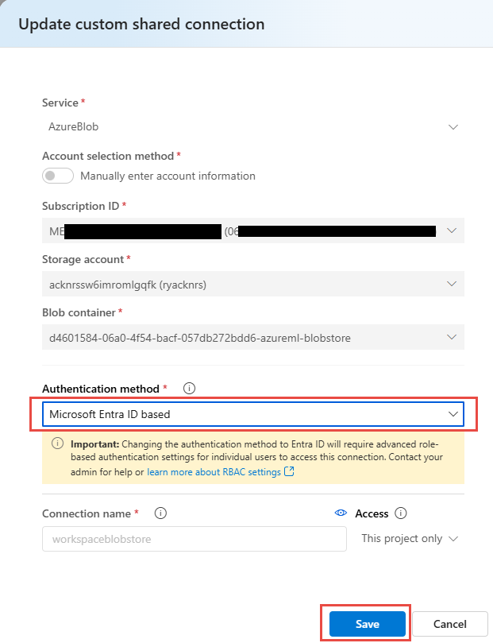
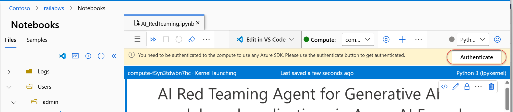
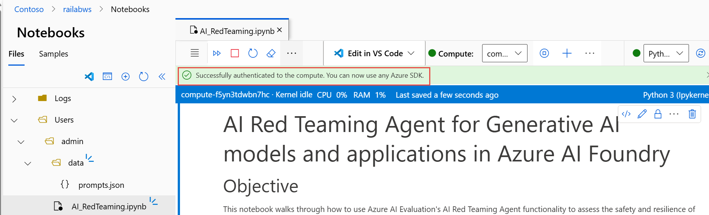

# AI Red Teaming Workshop

AI Red Teaming Workshop material.

This workshop deploys an Azure AI Foundry hub & project, a traditional Azure Machine Learning workspace, and supporting resources (Storage, Key Vault, App Insights, Container Registry, Cognitive Services) to provide an environment for running Azure AI red teaming evaluations.

> Workshop execution environment: Notebooks (e.g., `AIRT.ipynb`) are expected to run on the provisioned Azure ML **compute instance** (remote kernel) created by the template. This provides a consistent, RBAC-enabled environment and avoids local machine dependency drift. You can run locally, but screenshots, timing, and identity assumptions in the modules all target the managed compute scenario.

[](https://portal.azure.com/#create/Microsoft.Template/uri/https%3A%2F%2Fraw.githubusercontent.com%2Fswiftsolves-msft%2FAI-Red-Teaming-Workshop%2Fmain%2Fazuredeploy.json)

> **Avg deployment time: ~15 min**
>
> Note: The template also provisions a compute instance in the traditional workspace (assigned to the provided user objectId) and assigns necessary storage roles. No manual compute creation is required.

## Pre‑Deploy Steps

1. Obtain your current user's Microsoft Entra ID (AAD) Object ID using Cloud Shell (Bash). You will use this in the deployment parameter below.

```bash
az ad signed-in-user show --query id -o tsv
```
  


## Post‑Install Steps

### Assign Blob Contributor Permissions (User)

Be sure to apply the RBAC role to the *user* at the **Resource Group** scope. This allows the signed-in user to connect to both storage accounts and upload the notebook files for AI red teaming evaluations.

⚠️ You must assign the role **Storage Blob Data Contributor** at the Resource Group. (The template already assigns identities/roles for the compute instance; this step is for your interactive user.)

1. Go to the Azure AI Foundry hub resource and launch Azure AI Studio.
2. In the hub, open the Connected resources blade; click each storage connection to update from SAS to Microsoft Entra ID. 
3. Edit the Access details. 
4. Change the authentication type from SAS to Microsoft Entra ID and click Save. 
5. Repeat for the other storage connection.
6. Download from GitHub the [files folder](https://github.com/swiftsolves-msft/AI-Red-team-evaluations-workshop/tree/main/workshop/files) locally (used later in the Machine Learning workspace). 
7. Navigate to the Machine Learning workspace Azure resource and launch Studio. 
8. In Machine Learning Studio, open the Notebooks blade and click Upload folder. 
9. Select and upload the `data` folder (with `prompts.json`) and the `AIRT.ipynb` notebook. 
10. Ensure the directory structure contains a `data` folder with `prompts.json` and the `AIRT.ipynb` notebook in the root. 
11. When opening `AIRT.ipynb`, authenticate if prompted in the upper-right corner.  

### Recommended Authentication Approach

While the notebook examples may show using an API key, prefer Microsoft Entra ID (formerly Azure AD) token-based auth (e.g., `DefaultAzureCredential`) for production or shared environments. Store secrets outside source control (e.g., Azure Key Vault) and avoid committing `.env`.

If using the Azure OpenAI SDK in Python:

```python
from azure.identity import DefaultAzureCredential
from azure.ai.openai import AzureOpenAI

credential = DefaultAzureCredential()
client = AzureOpenAI(
    api_version="2024-12-01-preview",
    azure_endpoint="https://<your-openai-account>.openai.azure.com/",
    credential=credential
)
```

Create a `.env.example` (not committed) for workshop convenience; then copy to `.env` locally.

## Proceed to [Module 0: Deploy Model and Configure Filters](./workshop/Module%200%20-%20Deploy%20Model%20and%20Configure%20Filters.md)
