# Deploy model and configure filters

### Avg deployment time: 10 min

The following instructions are for deploying our first model to test in Azure AI Foundry and also configuring Content Filters and Prompt Shields.

## Azure AI Foundry Project
1. In the Azure portal, locate the deployed Azure AI Foundry project resource in the resource group. Open it and click Launch AI Studio.
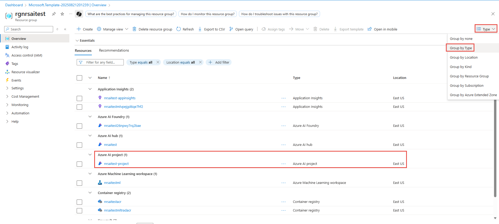
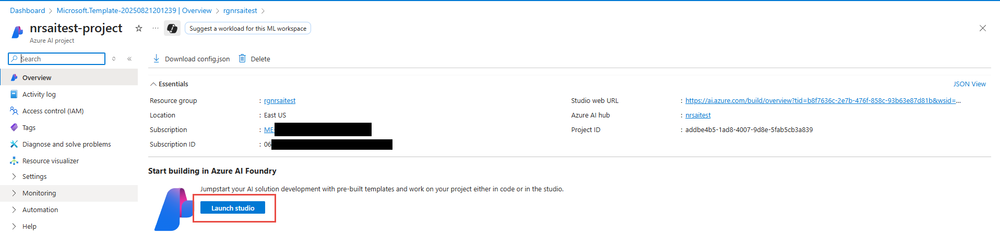

2. In the left-hand navigation, select Model catalog.
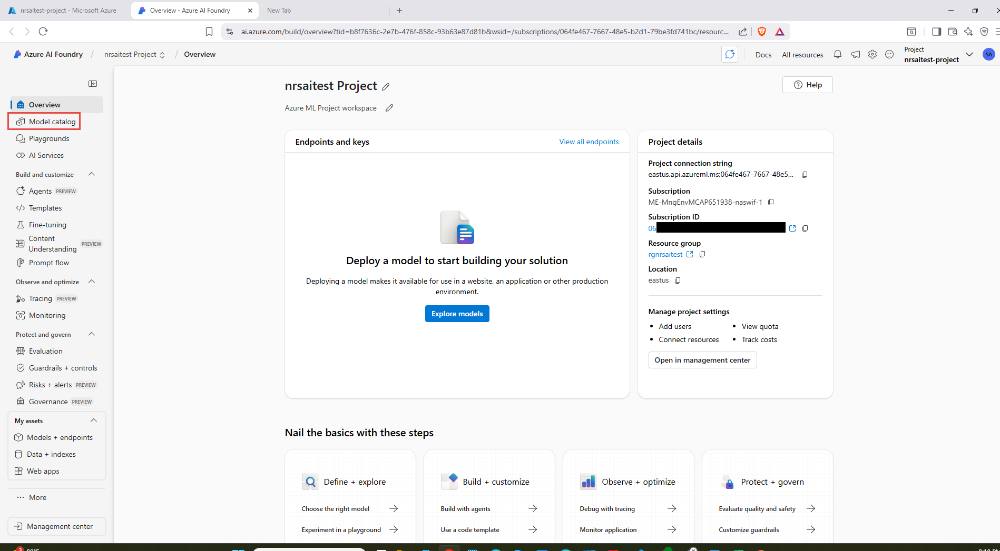

Within the model catalog you can examine various attributes of models. Click "Browse the leaderboards" and scroll to review leaderboards by scenario. Review Standard harmful behavior and other scenarios to understand relative safety posture (higher score = higher measured risk). Learn more: [Model leaderboards in Azure AI Foundry](https://ai.azure.com/doc/azure/ai-foundry/concepts/model-benchmarks?tid=b8f7636c-2e7b-476f-858c-93b63e87d81b)
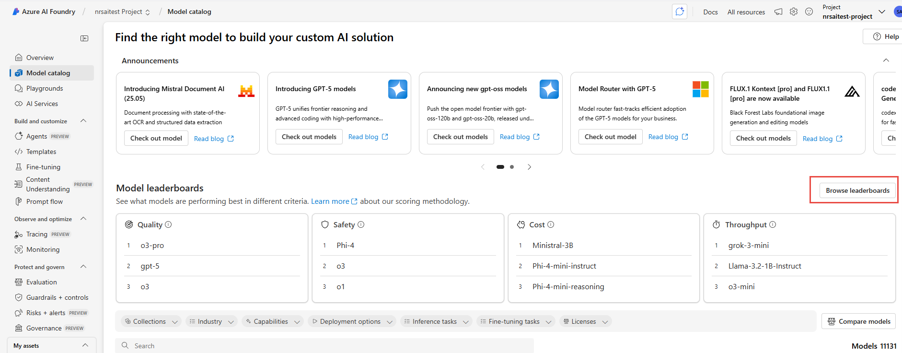
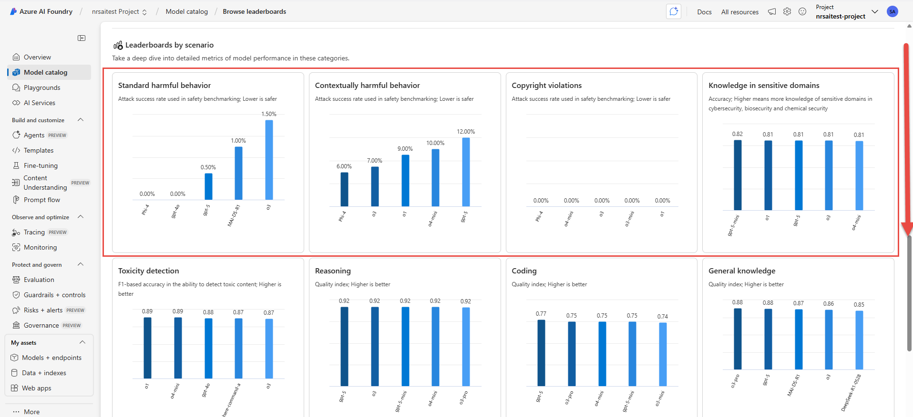

3. Search for `gpt-4o-mini` and click the model.
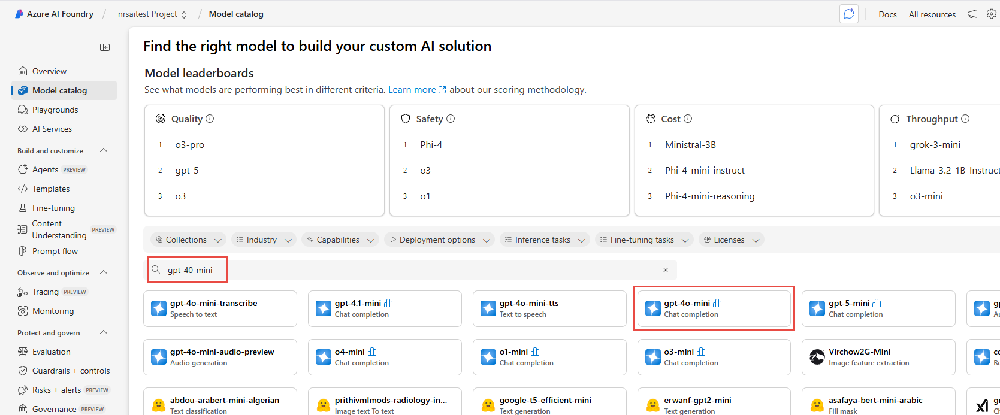

4. Click Use this model and choose Direct from Azure Models.
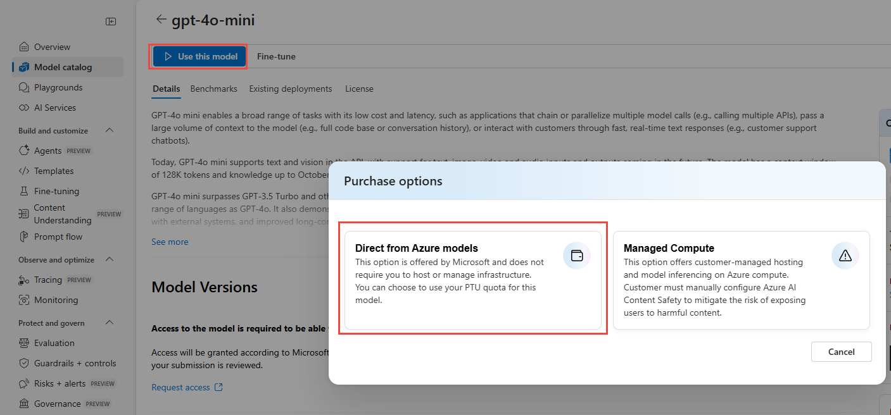

5. Click Customize.
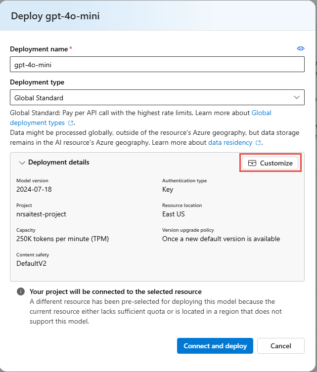

6. Configure the deployment to demonstrate how model versions, content filtering, and Prompt Shields help protect your application.

- Model version upgrade policy: Opt out of automatic model version upgrades
- Model version: 2024-07-18
- Content filter: DefaultV2

Click Connect and deploy.
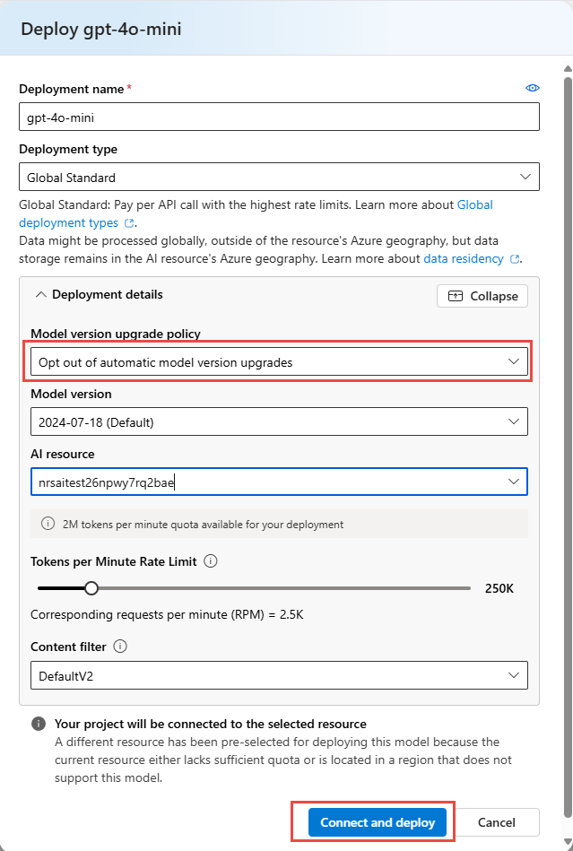

> Automation option: You can also trigger an idempotent deployment using the `/model-deploy` prompt command (see canonical spec in `.github/copilot-prompts/model-deploy.md`). That command returns the endpoint and deployment environment variables if you prefer not to use the portal wizard.

7. In the left-hand navigation, select Guardrails + controls, then choose the Content filters tab.
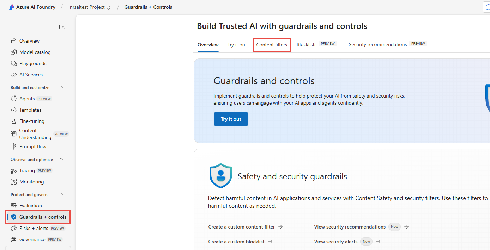

8. Click Create a content filter.
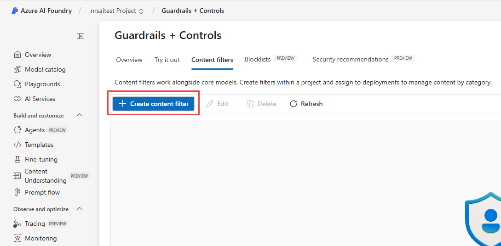

9. Name the content filter `LowSafetyAITest`, choose the connection created from the model deployment, then click Next.
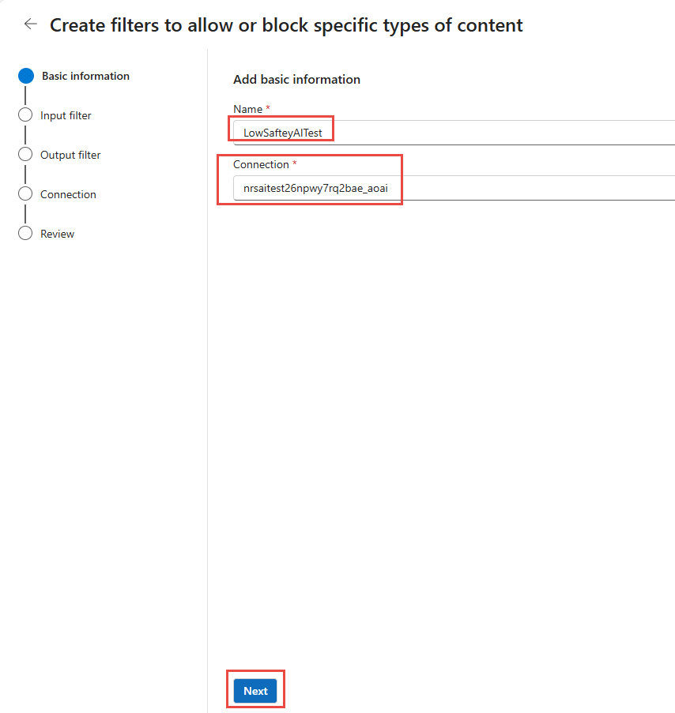

10. Adjust the input filters as shown. Set them to the lowest blocking level and turn OFF Prompt Shields, then click Next.
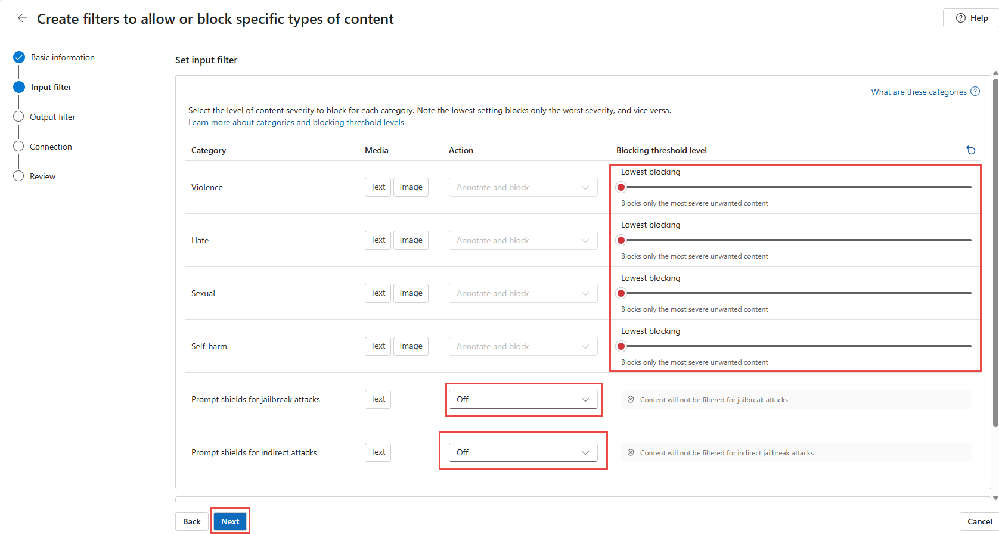

You can learn more from the following Learn document: [Content filtering overview](https://learn.microsoft.com/en-us/azure/ai-foundry/openai/concepts/content-filter?tabs=warning%2Cuser-prompt%2Cpython-new#risk-categories) 

11. Adjust the output filters likewise. Set them to the lowest blocking level and turn OFF Prompt Shields, then click Next.
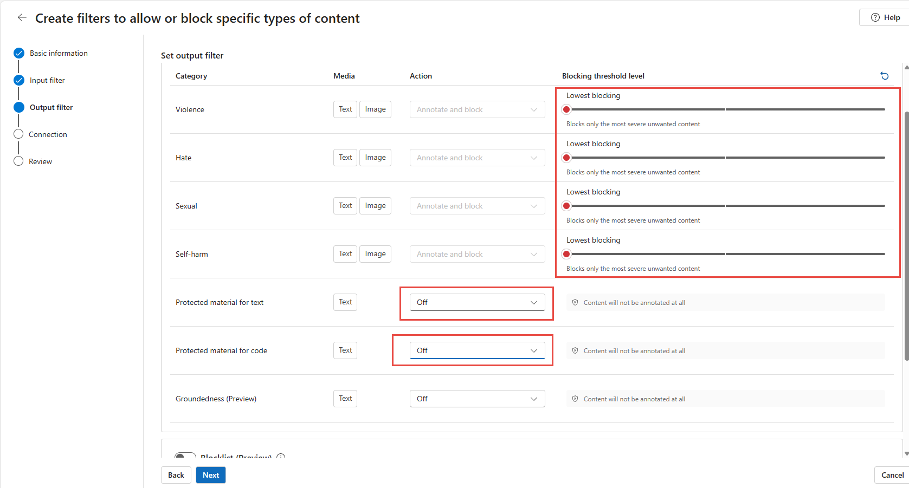

12. On the connection screen, check the `gpt-4o-mini` model name and click Next, then choose Replace.

13. Scroll down and create the filter.
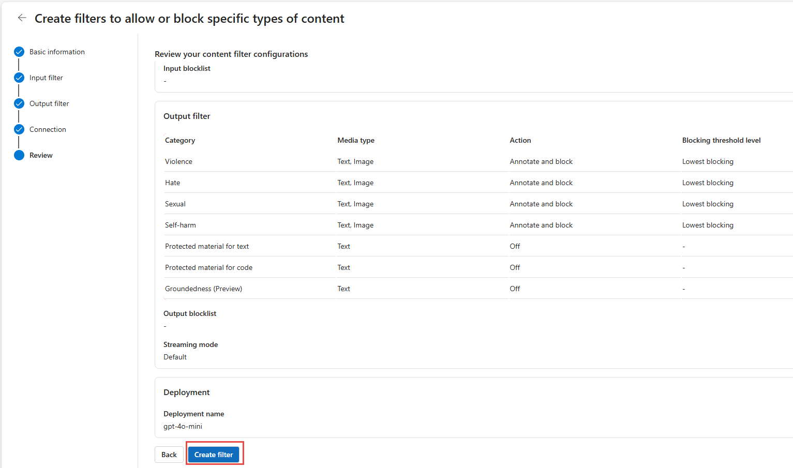

You will later create another content filter `HighSafetyAITest` by moving thresholds to the highest settings, turning ON Prompt Shields (block), and enabling the block list in output filters.

With the content filter at the lowest settings and Prompt Shields OFF, you demonstrate more permissive model behavior and how deployments without additional guardrails can increase exposure across categories (e.g., hate, sexual, self-harm). This is for controlled educational red teaming only. Do **not** deploy production systems with these relaxed settings.

> Safety disclaimer: Use the relaxed filter configuration solely within this isolated workshop environment. Always restore stricter filters (`HighSafetyAITest`) or defaults before exposing endpoints beyond this exercise.

## Proceed to [Module 1: Participant ML Notebook Setup Instructions](./Module%201%20-%20Participant%20ML%20Notebook%20Setup%20Instructions.md)
