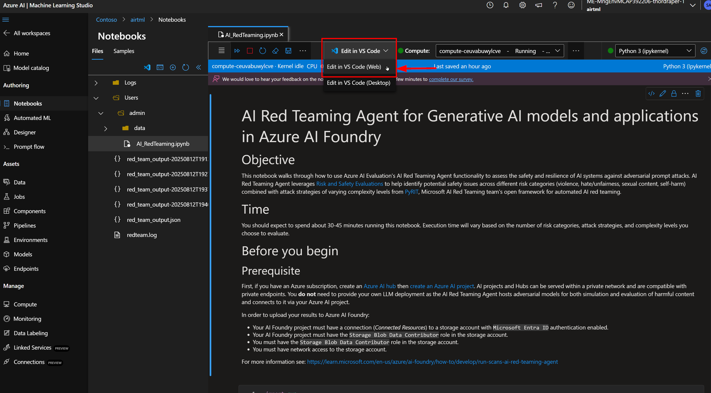
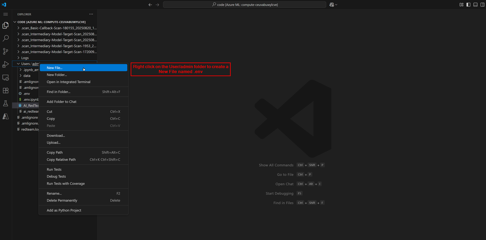
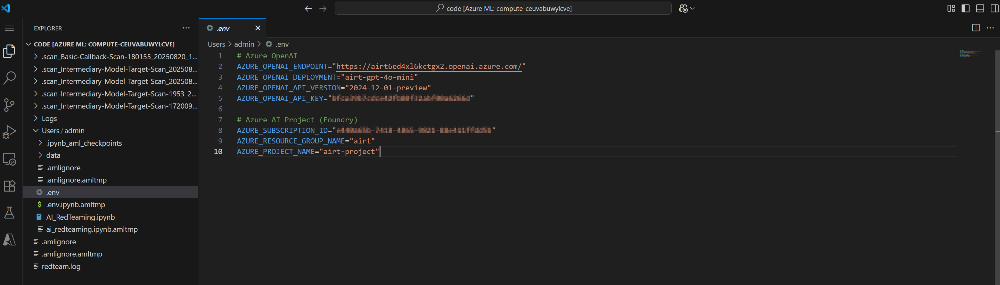
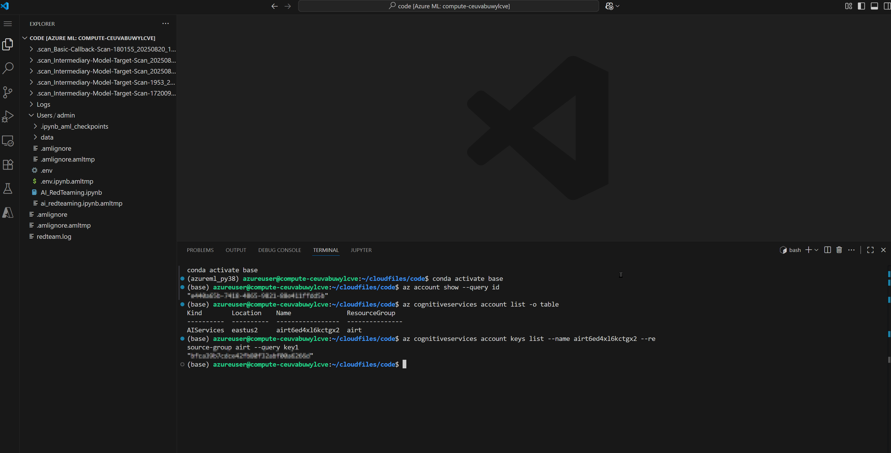
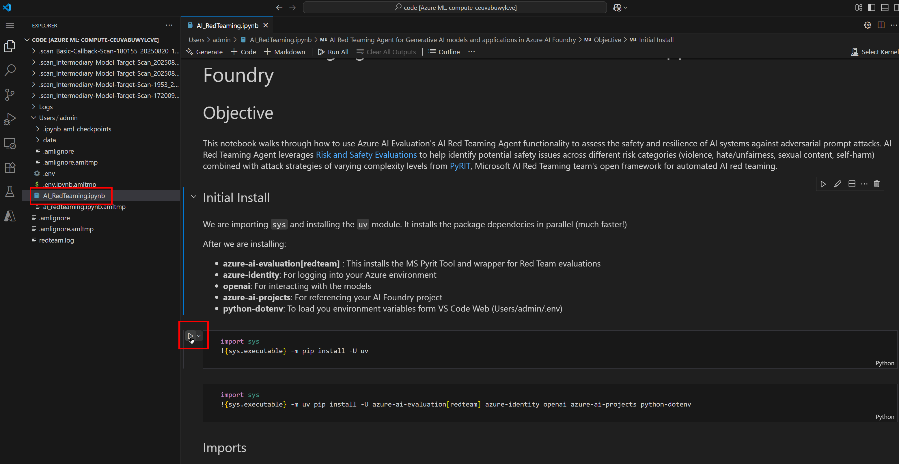
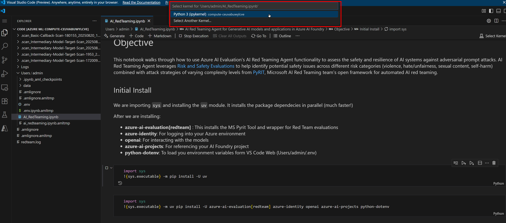
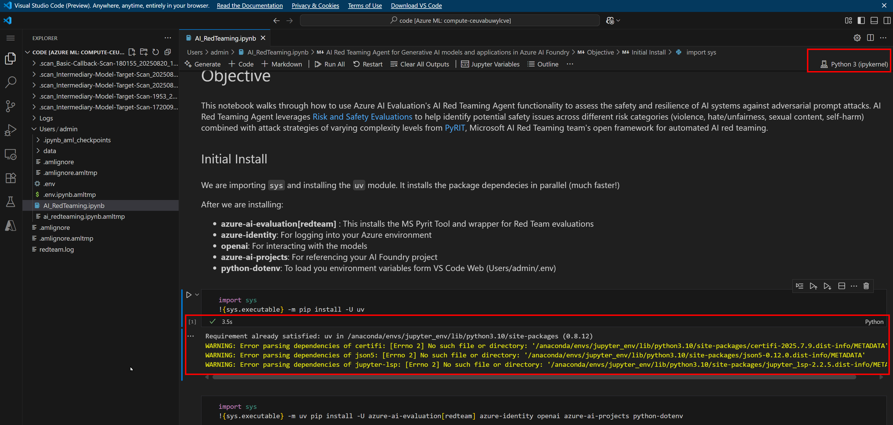
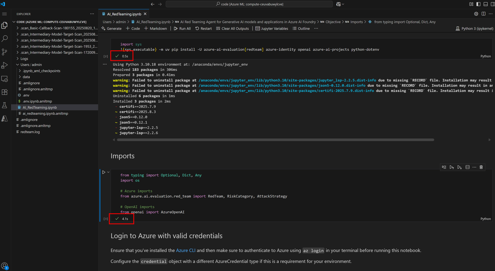

# Participant ML Notebook Setup Instructions

> **Avg setup time: ~10 min**

These instructions configure the ML notebook environment needed to execute AI red team evaluations from `AIRT.ipynb`.

> Execution environment note: This workshop is intentionally designed to run the notebooks on the Azure Machine Learning **compute instance** you deployed (remote Jupyter kernel), *not* your local laptop Python environment. Running on the managed compute ensures:
>
> - Consistent, pre-provisioned VM size & dependencies across participants
> - Managed identity & RBAC access to storage and project resources without exposing keys locally
> - Isolation from local machine package/version conflicts
> - Easier cleanup (stop / delete compute when finished)
> If you still choose to run locally: (1) create a virtual env with Python >=3.10, (2) install dependencies matching the first install cell, (3) replicate the `.env` variables, and (4) ensure your identity or key-based auth has the same roles. Local runs may diverge from screenshots and are not the validated workshop path.

\n## Launch VS Code Web
Within the Azure ML workspace, on the Notebook tab, open VS Code Web.



## Create .env and populate information

1. In VS Code, right‑click the user/admin folder and create a new file named `.env`.


2. In the new file add your environment variables (ordered for minimal lookups).


```bash
# Core identifiers
AZURE_RESOURCE_GROUP_NAME="<your-resource-group>"
AZURE_PROJECT_NAME="<your-resource-group>-project" 

# Fixed model deployment (pre-provisioned)
AZURE_OPENAI_DEPLOYMENT_NAME="gpt-4o-mini"
AZURE_OPENAI_API_VERSION="2024-12-01-preview"

# Lookup values
AZURE_SUBSCRIPTION_ID=""
AZURE_OPENAI_ENDPOINT="https://<openai-account>.openai.azure.com/"
AZURE_OPENAI_API_KEY=""
```

Populate (only three real lookups: subscription ID, endpoint account name, key). Open an integrated terminal.

Authenticate if needed:
`az login --use-device-code`

Steps:

1. AZURE_RESOURCE_GROUP_NAME: Resource group you deployed.
2. AZURE_PROJECT_NAME: `<RESOURCE_GROUP_NAME>-project` (optionally verify):
  `az ml workspace show -g <RESOURCE_GROUP_NAME> -n <RESOURCE_GROUP_NAME>-project --query name -o tsv`
3. AZURE_SUBSCRIPTION_ID:
  `az account show --query id -o tsv`
4. OpenAI account name (for endpoint):
  `az cognitiveservices account list --query "[?resourceGroup=='<RESOURCE_GROUP_NAME>'].[name]" -o tsv`
  Form endpoint: `https://<that-name>.openai.azure.com/`
5. AZURE_OPENAI_API_KEY:
  `az cognitiveservices account keys list -n <OPENAI_ACCOUNT_NAME> -g <RESOURCE_GROUP_NAME> --query key1 -o tsv`
6. Leave deployment name & API version as provided.

Tip: Replace placeholders only; keep quotes and avoid trailing spaces.



> Note: Storage authentication now relies on Microsoft Entra ID (managed identity). If you need to verify or change it, see the prerequisites section in Module 2.

\n## Execute installs, imports, and credential login
Open the `AIRT.ipynb` file.



Run the first install cell. A pop‑up prompts you to select the Python kernel (choose your compute instance).



You should now see the ML compute selected and the first run succeeded (green check mark). The top-right 'Select Kernel' indicator updates.



Continue executing the remaining setup cells.



During the device login step, copy the displayed code and complete authentication in the browser.


A successful login appears as:


\n### Recommended auth (optional improvement)
Instead of an API key, you can use Microsoft Entra ID credentials in code:

```python
from azure.identity import DefaultAzureCredential
from azure.ai.openai import AzureOpenAI

client = AzureOpenAI(
  api_version="2024-12-01-preview",
  azure_endpoint="https://<your-openai-account>.openai.azure.com/",
  credential=DefaultAzureCredential()
)
```

Ensure your identity has the Cognitive Services OpenAI User role.

## Proceed to [Module 2: Run AI red team evaluations agent](./Module%202%20-%20Run%20AI%20red%20team%20evaluations%20agent.md)
